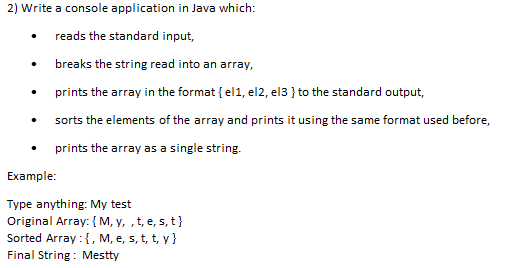
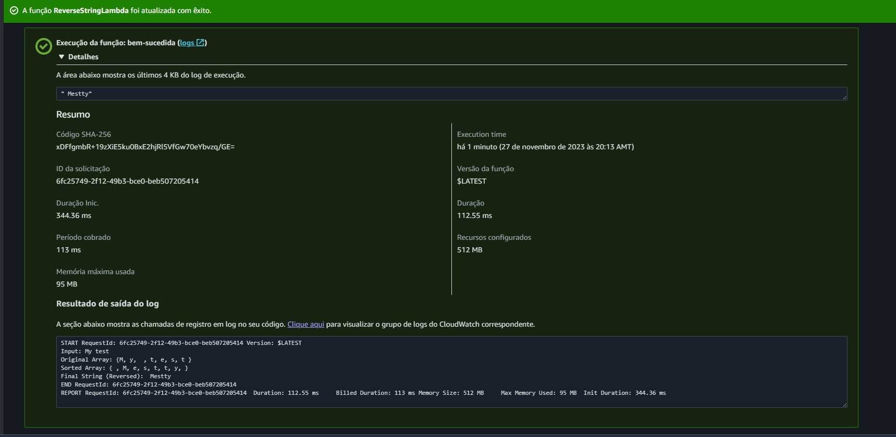

# Split and Reverse String in Lambda pure Java 17
## From LeetCode or HackerRank Challenges

This is a Split and Reverse String Project to learn Lambda using Pure Java 17

This will be Done in Console Java on Javac and also in AWS Lambda 17

I will try to set up AWS API Gateway to allow OPEN test of this Lambda.